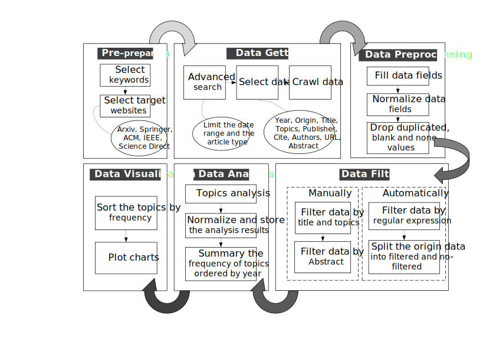

# auto survey

---

This tool supports the five popular libraries of literature include: Arxiv, IEEE, ACM, Springer, Science Direct, which can crawl the dataset of papers and do some data analysis. It helps you get a survey of your interested field automatically, by adjusting the configs of the above sites.

**The process shows in the follow figure:**

